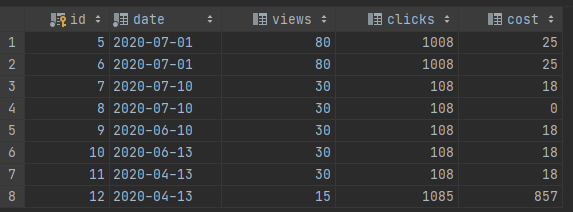

# Тестовое задание Avito
Галичин Антон galichin-anton@yandex.ru

### Задание:
Нужно разработать микросервис для счетчиков статистики. Сервис должен уметь взаимодействовать с клиентом при помощи REST API или JSON RPC запросов. Также нужно реализовать валидацию входных данных.

## API методы:
- Метод сохранения статистики
- Метод показа статистики
- Метод сброса статистики

### Установка
Скачайте файлы репозитория, установите зависимости из `composer.json`

Запустите Docker образ командой
```sh
$ docker-compose up
```
Файл с инициализацией базы данных находится в папке `/images/mariadb/sql/`. Он устанавливается автоматически во время компоновки Docker контейнера.

## Использование
В приложении для формирования HTTP запросов откройте адрес http://localhost:80/statistics, если адрес не работает,
проверьте файл `hosts` или посмотрите на каком IP-интерфейсе находится Docker контейнер.

В сервисе присутствует поддержка трех видов HTTP-запросов:
- GET
- POST
- DELETE

## GET
Изначальное состояние базы данных


GET запрос используется для получения статистики, агрегированной по дате.
В запросе необходимо передать дату начала статистики `from`, дату окончания статистики `to`, и опционально желаемый столбец сортировки `order`
Доступные столбцы:
- date
- views
- clicks
- cost
- cpc
- cpm

#### Пример GET запроса:
```sh
GET localhost:80/statistics
Body:
{
    "from": "2020-05-08",
    "to": "2020-07-15",
    "order": "cpm"
}
```
##### Ответ сервера:
```
200 OK
[
    {
        "date": "2020-07-10",
        "views": "60",
        "clicks": "216",
        "cost": "18",
        "cpc": "0.08",
        "cpm": "300.00"
    },
    {
        "date": "2020-07-01",
        "views": "160",
        "clicks": "2016",
        "cost": "50",
        "cpc": "0.02",
        "cpm": "312.50"
    },
    {
        "date": "2020-06-13",
        "views": "30",
        "clicks": "108",
        "cost": "18",
        "cpc": "0.17",
        "cpm": "600.00"
    },
    {
        "date": "2020-06-10",
        "views": "30",
        "clicks": "108",
        "cost": "18",
        "cpc": "0.17",
        "cpm": "600.00"
    }
]
```

## POST
POST запрос предназначен для сохранения статистики в базу данных. При вызове создается новая запись в таблице.
##### Параметры передаваемые запросом POST:
- date - дата события, строка формата `YYYY-MM-DD` - обязательный параметр
- views - число показов, целое число - необязательной параметр
- clicks - число кликов, целое число - необязатеьный параметр
- cost - стоимотрь кликов, дробное число (точность будет уменьшена о 2х знаков после запятой) - необязательный параметр

Ответом сервера является идентификатор добавленной записи.
#### Пример POST запроса
```
POST localhost:80/statistics
Body:
{
    "date": "2020-04-13",
    "views": 15,
    "clicks": 1085,
    "cost": 856.5
}
```

## DELETE
Метод удаляет всю накопленную статистику и возвращает клиенту число удаленных элементов
### Пример DELETE запроса
```sh
DELETE localhost:80/statistics
```
##### Ответ сервера:
```
200 OK
{
    "count": 9
}
```

